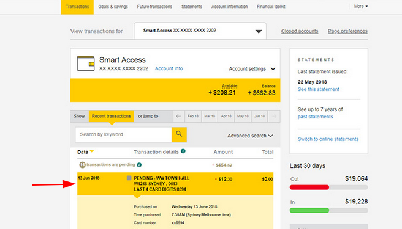

# YNAB CSV Processor for Commbank

This cli tool allows you to process commbank exported CSVs into ynab compatible 
CSVs. It keeps track of payees and aliases in a dictionary file.

## Installation
Have a copy of the rust stable toolchain installed.

Clone the repository and run `cargo install` in the root.

## Usage 
`ynab-cba -d <dictionary.yml> -o <output.csv> <target.csv>`

The dictionary and output flags are optional. If omitted, the files will be created
in the current working directory. 

When the application starts, you will be asked to paste in commbank unexported data.
When commbank exports a csv, it does not include transactions that are "pending". These are the 
gray transactions at the top of the list. 



You can select and copy all the items in the row into this space. It should look like this 

```
-----------------------------PASTE BELOW (ctrl-d to finish)----------------------------
24 Sep 2019
    Open transaction details
    PENDING - DENDY CINEMAS PTY LT NEWTOWN AUS
        -$19.
 24 Sep 2019
        Open transaction details
        PENDING - DENDY CINEMAS PTY LT NEWTOWN AUS
            -$19.
 24 Sep 2019
        Open transaction details
        PENDING - DENDY CINEMAS PTY LT NEWTOWN AUS
            -$19.
```

You may also press `ctrl-D` with no input to continue.

The whitespace will be trimmed by the app and is not significant. 

Once the parsed, the app will go over all the items in the list and start populating the 
dictionary. If it sees any items that are new, it will ask you for a name for that item.


